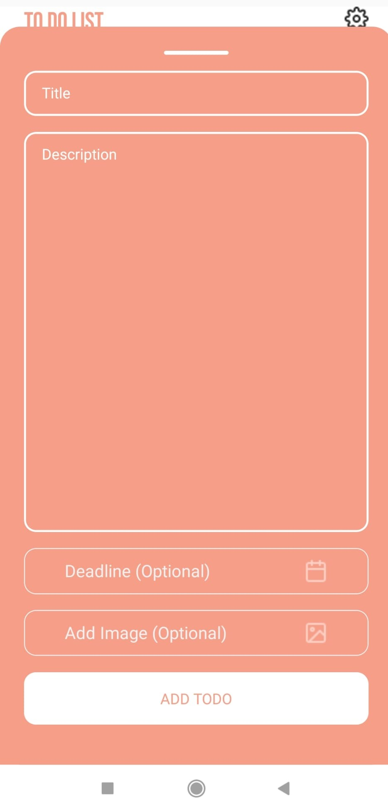

# ToDoList Project


## Overview

Welcome to **ToDoList App**, a React Native application that helps you stay organized and keep track of your tasks, deadlines, and even add images to enhance your productivity!

## Project Preview

<div style="display: flex; flex-direction: row; justify-content: center;">
  <div style="display: flex; flex-direction: row; margin-right: 20;">
    
    
  </div>
  
  <div style="display: flex; flex-direction: row; margin-right: 20px;"> 
    
    
  </div>
  
  <div style="display: flex; flex-direction: row;">
    
    
  </div>


## Design Notice

The app's design was created using Figma, a collaborative design tool that enables designers and developers to work together seamlessly. 
You can check out the complete design and layout of the app by visiting the [Figma](https://www.figma.com/community/file/1015172216261307231/Learn-UIUX-%3A-To-Do-List-App)


## Features

- Create tasks with due dates.
- Add images to your tasks for better visualization.
- Edit and update tasks as needed.
- Delete tasks when they're completed or no longer needed.
- Changes are automatically saved to the device's memory.

## Technologies Used

This project is built using the following technologies and packages:

- React Native: A popular JavaScript framework for building native mobile apps.
- React Context: Used for managing global state, making data sharing between components seamless.
- AsyncStorage: Enables data persistence, ensuring your tasks are saved even after closing the app.
- Image Picker: Allows you to choose images from your device's gallery or camera to associate with tasks.

## Getting Started

To run this project locally, follow these steps:

1. **Clone the repository:**

   ```bash
   git clone https://github.com/AtakanAlkn/ToDoList-ReactNative.git

   
2. **Navigate to the project directory:**
   
   cd ToDoList-ReactNative


2. **Install dependencies:**
   
   npm install
   or
   yarn install


3. **Start the development server:**

   npm start
   or
   yarn start

   
4. **Run on iOS or Android:**

   To run the app on iOS or Android simulators/emulators, use the following commands respectively:

   npm run ios
   npm run android
   or
   yarn ios
   yarn android
   
**Congratulations!**
You've successfully set up and started the project locally. Feel free to explore the code, make changes, and test new features.

**Troubleshooting**
If you encounter any issues during the setup process or while running the app, consider the following steps:

Double-check that you've correctly configured your environment variables in the .env file.
Ensure you have Node.js and npm (or yarn) installed on your system.
Make sure you have Xcode (for iOS development) or Android Studio (for Android development) properly set up.
Clear the npm or yarn cache and node_modules directory, then run the installation step again.
If the problem persists, please open an issue on our GitHub repository. We'll be glad to assist you!

## License
This repository is licensed under the [MIT License](LICENSE).

## Contact
If you have any questions, suggestions, or just want to connect, you can reach me at:
- Email: alkan.atakan@outlook.com
- LinkedIn: [Atakan Alkan](https://www.linkedin.com/in/atakanalkn/)


